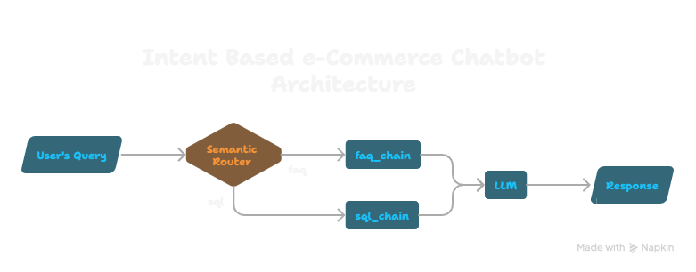
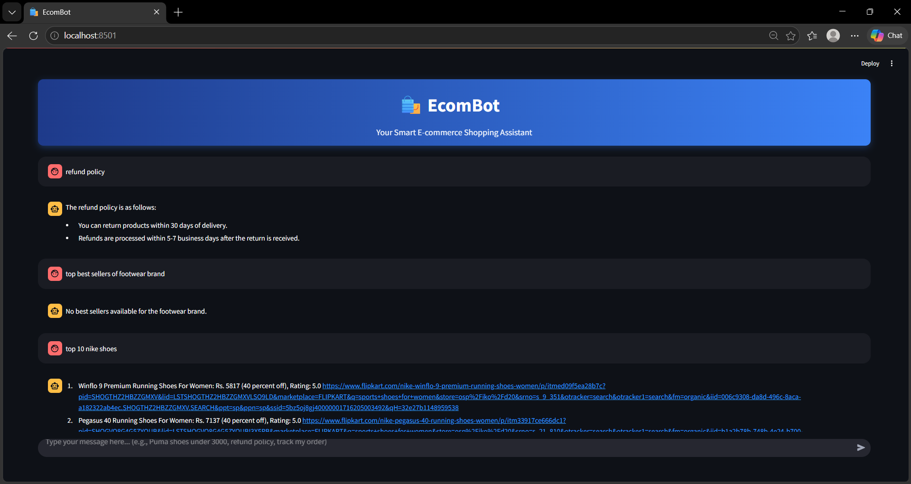
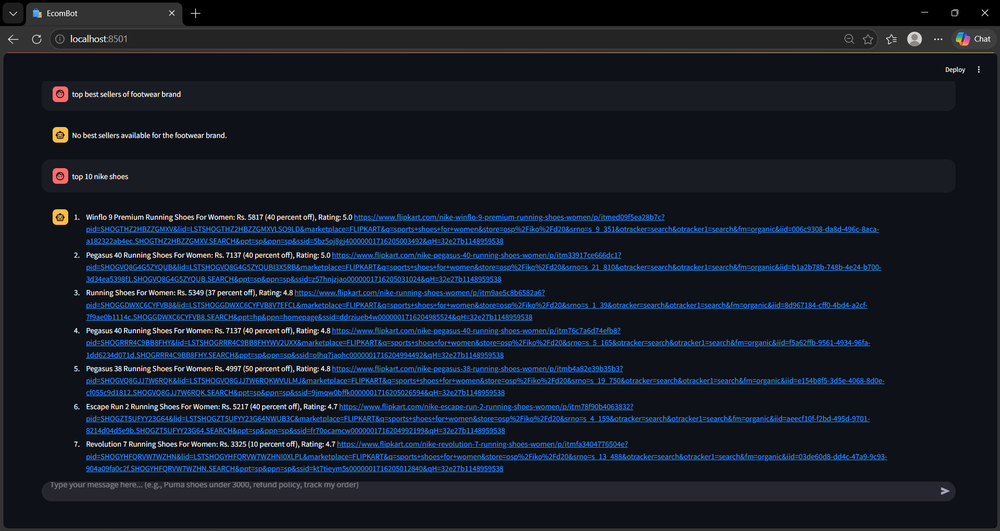

# 🛒 EcomBot

### AI-Powered E-commerce Chatbot using Llama 3.3, Groq & RAG

EcomBot is an intelligent e-commerce chatbot that provides real-time product search and customer support using Generative AI. It uses RAG, semantic routing, SQL querying, and Groq-powered LLM inference to deliver fast and accurate responses.

---

# 🚀 Features

* 🤖 AI-powered shopping assistant
* 🔍 Real-time product search
* 📚 FAQ & policy support
* 🧠 Intent-based routing
* ⚡ Fast responses using Groq
* 🌐 Streamlit interactive UI

---

# 🏗️ Architecture



---

# 📸 Screenshots

### 🏠 Home Interface



---

### 🔍 Product Search Demo



---

# 🛠️ Tech Stack

| Category         | Technologies    |
| ---------------- | --------------- |
| Programming      | Python          |
| Frontend         | Streamlit       |
| LLM              | Llama 3.3       |
| Inference Engine | Groq            |
| Vector Database  | ChromaDB        |
| Routing          | Semantic Router |
| Database         | SQL             |
| AI Architecture  | RAG             |

---


# ⚙️ Setup

```bash
git clone <repo-link>
cd EcomBot
```

Create virtual environment:

```bash
py -m venv .venv
source .venv/Scripts/activate
```

Install dependencies:

```bash
pip install -r requirements.txt
```

Create `.env` file:

```env
GROQ_MODEL=llama-3.3-70b-versatile
GROQ_API_KEY=your_groq_api_key
```

Run application:

```bash
streamlit run app/main.py
```

---


